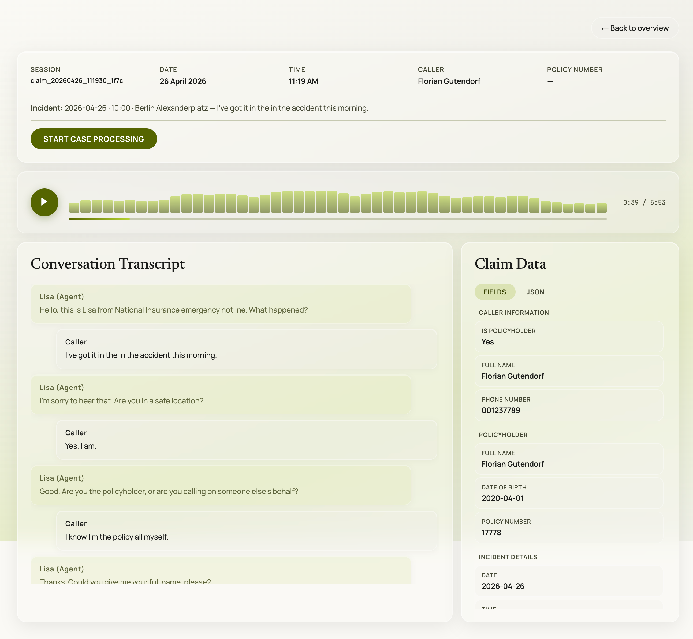

# Lisa - Insurance Claims Voice Agent

> **Big Berlin Hack · April 25–26, 2026**
> Challenge by [Inca](https://www.get-inca.com)

---

## The Challenge

Inca's "Human Test": build a phone-based voice agent that handles inbound insurance claim calls and convinces the callers they are speaking to a human. The jury *are* the callers - each juror calls the number, plays a claimant reporting an accident, then casts a blind vote: **human or AI**. To win, the agent needs more than 50% human votes and must produce complete, high-quality call documentation.

---

## What We Built

**Lisa** - a real-time voice agent that answers inbound calls, conducts a full structured motor insurance claims intake, and sounds human enough to cross the 50% threshold. Built in roughly 24 hours.

**Example call recording:**

<video src="https://github.com/user-attachments/assets/c078c882-fa34-4c63-84c5-70e9beb60bd3" controls style="width:100%;max-width:640px"></video>

**Frontend Screenshot**



---

## Approach

### Real-time voice with Gemini Live

The core conversation runs on Gemini 3.1 Flash Live - Google's real-time multimodal API that handles speech-to-speech directly within a single low-latency session. This gave us full-duplex voice with barge-in support and VAD out of the box, without stitching together separate ASR and TTS services.

### Keeping response time human-like

Structured data extraction (turning the conversation into a claim record) is handled by a separate Gemini 3.0 Flash call. Rather than blocking the live session while waiting for that extraction, we offload it to a background thread. The agent's voice response goes out immediately; the claim state updates asynchronously. This keeps perceived latency in the human range even when extraction takes a moment.

### Sounding human

- An automated-sounding opening message plays first (deliberately lower-quality voice), making Lisa's actual voice sound noticeably better by comparison
- Ambient office background noise mixed under the agent's speech
- Natural voice (Gemini's "Kore" voice, tuned VAD sensitivity)
- A declarative YAML playbook drives the intake flow via function calling - the agent never sounds like it's reading a form

### Structured output

After the call, every session writes a full transcript, a structured JSON claim record, and the raw audio to disk. A FastAPI backend exposes these via a REST API; a web UI built with Lovable renders the session data live.

---

## Tech Stack

| Layer | Technology |
|---|---|
| Voice AI | Gemini 3.1 Flash Live (real-time speech-to-speech) |
| Data extraction | Gemini 3.0 Flash |
| Telephony | Twilio Programmable Voice + Media Streams |
| Backend | FastAPI · Python 3.13 |
| Frontend | Lovable |
| Audio bridge | WebSocket · G.711 μ-law codec · numpy |

---

## Architecture

```
Incoming call (Twilio)
       │
       ▼
  FastAPI server
  /twilio/voice  ──► TwiML: connect to WebSocket
  /twilio/media  ──► WebSocket bridge
       │
       ▼
  Gemini Live session          ← real-time speech-to-speech
       │
       └── function call: cancel_call
                └── Gemini Flash (background thread)  ← async, non-blocking
                         └── update_claim_state
                         └── finalize_claim → writes transcript + claim JSON + audio to storage/
```

---

## Team

- Mattheu Classen
- Florian Gutendorf Heiwig

---

## Quick Start

Requires Python 3.13+ and [`uv`](https://docs.astral.sh/uv/).

```bash
git clone <repo-url>
cd voice-project
uv sync --extra dev
cp .env.example .env   # fill in GEMINI_API_KEY
uv run python app/main.py --text-mode
```

**Run with a real phone call** (Twilio + ngrok):

```bash
ngrok http 8080                                    # copy HTTPS URL → TWILIO_PUBLIC_URL in .env
uv run python app/main.py --twilio-setup           # register webhook
uv run python app/main.py --twilio-server --port 8080
```

---

## Attributions

- Ambient office audio: *The Office* by Iwan Gabovitch - [CC BY 3.0](https://creativecommons.org/licenses/by/3.0/)
- Beep sound: Sound Effect by freesound_community via [Pixabay](https://pixabay.com)
